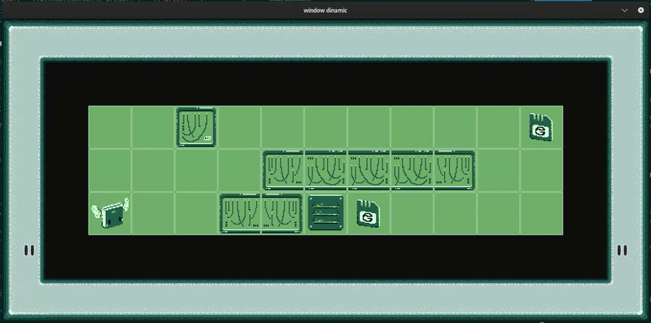
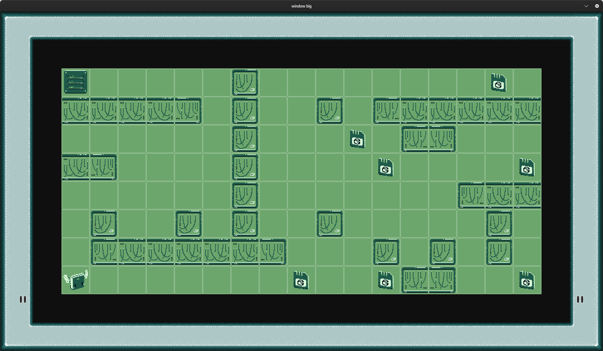
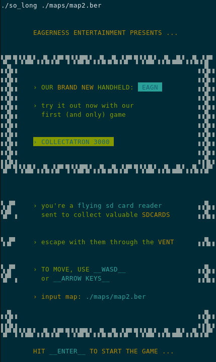
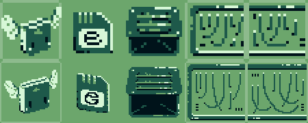
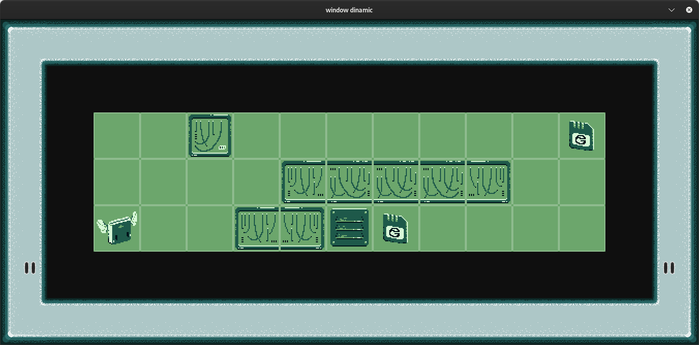

# so_long

> A game where you pick up collectables to win made entirely in C

_**so_long**_ is the very first graphical project in the 42 cursus. Taking advantage of previous projects such as [_**libft**_](github.com/moist-bread), [_**ft_printf**_](github.com/moist-bread) and [_**get_next_line**_](github.com/moist-bread), it dwelves into input parsing and simple game mechanics.

## 📖 CHAPTERS

* [quickstart](#quickstart) 🏁
* [input and maps](#input-and-maps) 🗺️
* [graphics using mlx](#graphics-using-mlx) 👾
* [visuals and concept](#visuals-and-concept) 👁️‍🗨️
* [conclusion](#conclusion) 🦾

## QUICKSTART

The concept of my so_long is based on the handheld style and feel of the gameboy. In it you play as an SDCARD reader and collect SDCARDS. After collecting them all you can escape through the vent. As simple as that.


</img>

</img>

If you want to try this out for yourself you can simply clone this repository and do the following:

```bash
make levels
```

That will compile the program and run it sequentially with 8 maps I created.


</img>

## INPUT AND MAPS

This game recieves a command line argument of a path to a file, that it will then read and use as a map. To do that we can use the [**get_next_line**](github.com/moist-bread) function to extract it's contents and then see if the map it found is valid.

For a map to be valid it needs to obey to a few rules:

* the file needs to have the `.ber` file extension
* it needs to be rectangular
* it can only contain the chars `0` (floor), `1` (wall), `C` (collectable), `E` (exit) and `P` (player)
* only one exit and player allowed
* there needs to be a valid path for the player to get to all the collectables and to the exit

I also implemented an extra "rule" that is a size limit of 38 (width) by 22 (heigth), so that with my smaller sprite size it would still fit in a 1080p screen.

## GRAPHICS USING MLX

For this graphical project to be done entirely in C we were allowed to make use of the [**minilibx**](https://github.com/42Paris/minilibx-linux) a library to facilitate the use of X11.

For that we first create the window, I decided to switch between a dynamic window size and a fixed one depending on how big the map is. If it's less than 10 by 19 I let it be dynamic (being as big as the map is times 90 pixels), in all other cases it's 1080p.

To be able to put images on the screen they need to be `.xpm` to then use the `mlx_xpm_file_to_image` .

## VISUALS AND CONCEPT

As previously mentioned the concept of this so_long is based on the gameboy, which originated into the fictional handheld `EAGN`. To make it look like a handheld the game gained a padding around it that would look like a shell of the console, and it's exterior walls became black borders to replicate the screen.

For the small maps to not be too little to see I created two sets of sprites (45x45, 90x90) from which the program would pick and adapt depending on the size of the given map!


</img>

There's also a few extra details like buttons and a logo that show up (or not) also based on the mapsize.


</img>

## CONCLUSION

Despite the simple premise I learnt a lot from this project, not only how to do the most whislt using the least amount of sprites, like how it was usual for games in older consoles with hardware limitations, by flipping and rotating them inside the program. But also technical things such as the full potential of **Makefile rules** and the utility of **compound literals**. 

#### 🦾 POSSIBLE FUTURE IMPROVEMENTS:

* Adding fps and animations
* Adding enemies
* Less use of the heap and more use of the stack
* Use of sprite sheets instead of individual sprites
* Aesthetic improvement to buttons and logo assets
* Make the buttons on screen visually change when you're moving
